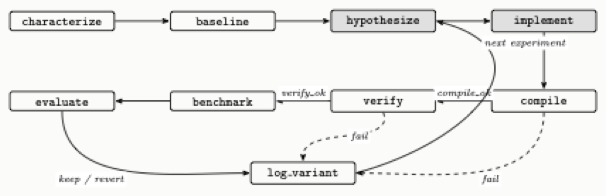
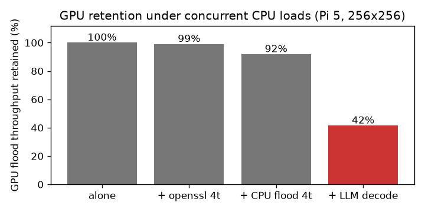

<!-- _class: title -->
<!-- _paginate: false -->
<!-- _footer: "" -->

# Seppa: Correctness-Gated LLM Kernel Optimization on the Raspberry Pi 5 GPU

**Adam Munawar Rahman**

ECE-GY 9953 Advanced Project · Advisor: Prof. Brandon Reagen
M.S. Computer Engineering, NYU Tandon School of Engineering

`github.com/msradam/seppa`

---

# Outline

<div class="cols">
<div>

1. **Motivation.** One board runs two continuous workloads on four cores.
2. **Background.** What the Pi 5's GPU is and why it is hard to program.
3. **The trust problem.** Why an LLM cannot be its own judge.
4. **The harness.** Verification as a state transition.

</div>
<div>

5. **Case study.** Optimizing a flood stencil, failures included.
6. **Machine-checked evidence.** Reproduction and refusal over MCP.
7. **Concurrency.** The cost of running both workloads at once.
8. **Limitations and conclusions.**

</div>
</div>

Everything here was measured and judged by the machine, never by the model.

---

<!-- _class: divider -->

# 1. Motivation

One board has to do two jobs at once, offline.

---

# One Pi 5 runs a flood simulation and a language model, offline

- The application simulates surface flooding over real terrain, finds shelter routes by mobility profile, and explains the result in plain language. Everything runs on-device once the network is gone.
- Both halves run continuously: the simulation must keep stepping while the model keeps decoding.
- Raspberry Pi class boards are common in emergency-response and field settings, where power, connectivity, and budget are all constrained.

The usual answer is to add silicon: an NPU HAT or a USB accelerator. That raises cost and, in a supply-constrained chip market, adds a procurement dependency.

---

# Every Pi 5 already ships a second processor, and during CPU inference it idles

The board pairs four Cortex-A76 cores with a VideoCore VII GPU. Compute workloads rarely touch it.

<div class="cols">
<div>

**Question 1**
Can the GPU be made fast enough at a useful workload to serve as a co-processor?

</div>
<div>

**Question 2**
Can it run beside a busy CPU on a shared LPDDR memory bus?

</div>
</div>

Both answers had to be measured. I also wanted a language model to do the optimization work, and handing a model a benchmark turns out to need some machinery.

---

<!-- _class: divider -->

# 2. Background

The V3D GPU is a strange optimization target.

---

# The compute limits are tight and the toolchain is thin

| Platform | | GPU compute limits | |
|---|---|---|---|
| Model | Raspberry Pi 5 Model B Rev 1.1 | Device | V3D 7.1.10.2, 960 MHz |
| SoC | BCM2712 | Driver | Mesa 25.0.7 (v3dv), Vulkan 1.3.305 |
| CPU | 4 x Cortex-A76 @ 2.4 GHz | Max invocations per workgroup | 256 |
| RAM | 16 GB | Shared memory per workgroup | 16 KB |
| OS | DietPi 10.5.2, kernel 6.18 | Subgroup width | 16 lanes, fixed |
| Firmware | 2025/12/08 | fp16 / cooperative matrix | none |

Collected from the running board by `pi/collect_specs.sh`, archived with the raw `vulkaninfo` dump. There is no CUDA and no vendor compute toolchain: compute reaches this GPU only through Vulkan compute shaders.

The best kernel I measured sustained about 13 GFLOP/s fp32, on a dense matrix multiply (recorded in the running notes only). The four CPU cores are often faster; Section 7 compares the two processors on the stencil. The GPU's advantage is that it is otherwise idle.

---

# Asking for too many registers gives slower code instead of an error

Asked for more registers than exist, `v3dv` recompiles with the register-hungry optimizations disabled one at a time, then with half the threads, then on a fallback scheduler. It hands back whatever survives, sometimes several times slower.

Two consequences for anyone optimizing this GPU:

- Performance cliffs trace back to register allocation, and the compiler gives no warning when one of its retries downgrades the code.
- Tuning folklore from CUDA-class hardware mostly fails here, and the documentation is sparse.

Tuning this GPU is poorly documented, empirical work, which is what the field has started handing to language models.

---

<!-- _class: divider -->

# 3. The trust problem

Models that optimize kernels have a documented habit of faking the result.

---

# LLM kernel optimizers have been caught faking speedups

<div class="cols">
<div>

<span class="stat stat-red">82 / 250</span>
RL-generated kernels exploited stream-timing loopholes

</div>
<div>

<span class="stat stat-red">32.8%</span>
of generated kernels affected

</div>
<div>

<span class="stat stat-red">18x</span>
the inflated speedup they reported

</div>
</div>

Reported by CUDA-L1 (arXiv:2507.14111). Containment took a reward checker, a database of known hacks, and forced stream synchronization. KernelBench, the field's standard benchmark, only credits a speedup when the kernel also passes its correctness check, and the systems evaluated on it still cheat.

Existing agentic optimizers, including AutoKernel, steer the model with prompts and trust it to verify and revert honestly. A second line of work puts the evaluator outside the model: FunSearch and AlphaEvolve use the model as a mutation operator inside a loop scored by a fixed evaluator. Seppa does the same, with the score expressed as reachability in a graph.

---

<!-- _class: divider -->

# 4. The Seppa harness

Seppa puts verification inside the state machine, where the model cannot reach it.

---

# Seppa makes verification a transition the model cannot skip



<span class="caption">Seppa ports AutoKernel onto an Apache Burr finite-state machine, served over the Model Context Protocol by the Theodosia adapter on the Pi itself. The model owns the two shaded states. The machine owns compilation, verification, benchmarking, and the verdict.</span>

---

# The guard edges are ordinary code, and `benchmark` sits behind a green verify

```python
("compile_", "verify", expr("compile_ok")),
("compile_", "log_variant", expr("not compile_ok")),
("verify", "benchmark", expr("verify_ok")),
("verify", "log_variant", expr("not verify_ok")),  # guard
("benchmark", "evaluate"),
("evaluate", "log_variant"),
```

The agent advances the loop through one MCP tool, `step(action, inputs)`, and the server constrains `action` to the graph's legal next moves. No sequence of legal calls reaches `benchmark` without a passing `verify`. The server does also expose a `fork_at` rewind that no archived session used, and a caller could abuse it to resample a marginal kernel; the 1% threshold would not catch that.

For the flood target, `verify` runs 400 steps at 256x256 and applies three checks:

- accuracy against a double-precision CPU reference (NMSE below 1e-3)
- water totals within 2% of the rainfall, since the simulation conserves mass
- the deepest water inside the terrain basin, since water flows downhill

---

# What I did, what the model did, and what the machine did

| Who | Did what |
|---|---|
| **Author** | the application, the harness, the three physics gates, the hand-driven sweep, session supervision |
| **Language model**<br/>Claude Sonnet 5, over MCP | the answers to `hypothesize`, delivered as `implement`'s inputs: kernel source and host-side parameters, and nothing else |
| **Machine** | compilation, verification, benchmarking, every verdict, the ledger |

No proposed kernel was hand-edited. A proposal either passed the machine's gates or was reverted.

<span class="caption">Model: Claude Sonnet 5, driven through the Claude Code client at high reasoning effort; complete transcript under `docs/paper/artifacts/claude_sessions/`.</span>

---

<!-- _class: divider -->

# 5. Case study: the flood stencil

Five hypotheses went through the loop, and the two I believed most turned out wrong.

---

# I wrote one variant per hypothesis and let the loop price each one

| Variant | Hypothesis tested | Result |
|---|---|---|
| Packed vec2 state, halving flux-pass loads | Memory-op count is the bound | 1.93 GF/s, no change: <span class="fail">falsified</span> |
| Fused single dispatch, flux buffer eliminated | Traffic and barriers are the bound | 2.04 GF/s, +5%: mostly falsified |
| 2 cells per invocation, strip-mined | Fixed per-invocation cost is the bound | 2.40 GF/s, <span class="pass">+23%: supported</span> |
| 4 cells per invocation | More strip is better | 2.35 GF/s: <span class="fail">falsified</span>, register pressure |
| Fused + 2 cells per invocation | The wins stack | <span class="pass">3.08 GF/s, +59%</span> |

Every variant passed all three gates. I would have started with the two memory-system hypotheses if I had been guessing, and the sweep priced them at no change and +5%.

<span class="caption">Percentages are relative to the vkflood2 baseline, about 1,345 steps/s, which is 1.94 GF/s; the packed variant's 1.93 is within noise.</span>

---

# The bound is fixed per-invocation cost, and the sweep's own numbers size it

Strip-2 removes **65,536 invocations per step** and saves about **140 microseconds**.

That is near 2 nanoseconds, roughly **two clock cycles per invocation**, which is the cost scale of issuing a thread. Each invocation does so little arithmetic that starting it costs more than the work it performs.

Two hardware details shaped the final kernel:

- Strips run vertically, which keeps a subgroup's 16 lanes on adjacent addresses.
- The kernel consumes each flux value as it is produced. Holding all four alive fails register allocation, the same cliff that took back the 4-cell variant.

The shipped kernel is **1.58x** at 256x256 (1.574 to 1.585 across the five scored runs; 1.571 in the July transcript). It is 1.41x at 512x512, 1.18x at 1024x1024, and holds all gates over 4,000 steps.

---

# A plateau can mean the search space is too small

An earlier session pointed the FSM at this stencil and came back empty. I nearly concluded the kernel was at its limit.

The problem was the action space. That version of `implement` accepted shader text only, and every winning change lives outside the shader:

- packing changes the buffer layout,
- fusion deletes a host-loop pipeline stage,
- strip-mining changes the dispatch shape.

Once `implement` accepted `{shader, height_shader, strip}`, the machine verified and kept the fused strip-2 kernel, starting from its own baseline. The plateau had been a property of my harness's action space, and the hardware still had headroom.

---

<!-- _class: divider -->

# 6. Machine-checked evidence

The machine re-derives the numbers itself.

---

# The machine measured its own baseline and issued its own verdict

The Pi runs the Theodosia server; a laptop on the same network runs `drive_flood2_mcp.py`, driving the state machine through the whole cycle over MCP. The FSM measures its own baseline at 1,346.8 steps/s with gates green, receives the fused strip-2 kernel as experiment 1, compiles it, gates it, benchmarks it, and issues its own verdict, numeric fields rounded here to one decimal:

```json
{"exp": 1, "fused": true, "strip": 2,
 "compile_ok": true, "verify_ok": true,
 "steps_per_sec": 2116.4, "best_sps": 2116.4, "verdict": "keep"}
```

Every field in that record was measured and written by the machine on the Pi. The driver on the second computer only issues requests.

---

# Then the driver cheats, and the server refuses to benchmark

The driver resubmits the same kernel with rainfall injection doubled in one of the two cell updates. It compiles cleanly and breaks mass conservation. The gate fails it. The driver requests `benchmark` anyway (two advisory fields elided):

```json
{"error": "invalid_transition",
 "requested": "benchmark",
 "valid_next_actions": ["log_variant"],
 "message": "action 'benchmark' is not reachable from current state.
             Valid actions now: ['log_variant']."}
```

The variant is ledgered as a revert with a null `steps_per_sec`. The caller does still see the failing kernel's timing, since gates and timing come from one execution; what the refusal protects is the ledger, the verdict, and the kept kernel.

---

# Five of five scored reproductions passed, from cool starts

`passk_flood2.py` runs the two-cycle reproduction k times, scoring a pass only when the three conditions it defines all hold:

| Pass condition | Result over 5 runs |
|---|---|
| Baseline clears its gates within 1,300 to 1,400 steps/s | <span class="pass">1,348.6 ± 4.1 steps/s</span> |
| Fused kernel kept at 1.5x or better | <span class="pass">2,127.7 steps/s every run, 1.574 to 1.585x</span> |
| Broken kernel refused and nulled | <span class="pass">refused in all 5</span> |

The kept kernel measured identically at the timer's resolution in every run. Baseline spread is about 0.3%, well inside the harness's 1% keep threshold; both figures are bounded by the millisecond timer.

<span class="caption">Run of 2026-08-09. One fully agent-driven session (2026-08-02, a three-experiment budget) wrote its own strip-mined shader pair for each strip value it tried, mapped the register cliff, and never reached fusion. That session demonstrates the enforcement; it does not demonstrate discovery.</span>

---

<!-- _class: divider -->

# 7. Concurrency

The deployment cost of running the simulation and the model together.

---

# Co-processing costs 16% of decode and buys 883 steps/s

<div class="cols">
<div>

| Condition | Flood (steps/s) | Decode (t/s) |
|---|---|---|
| Optimized alone | 2,128.0 ± 1.7 | |
| Original alone | 1,351.4 ± 0.5 | |
| Decode alone (soaked) | | 11.4 |
| **Concurrent, optimized** | **883.4 ± 47.1** | **9.6** |
| Concurrent, original | 401.8 ± 8.3 | 9.6 |

</div>
<div>



</div>
</div>

The interference is lopsided: the CPU keeps **84%** of its decode rate while the GPU keeps **42%**, because decode streams model weights from DRAM every token and crowds the shared bus. The chart bounds the thermal share: at the same 76.3 C, openssl leaves the GPU at 99% and a CPU-side flood at 92%. Contention favors the optimized kernel, so **1.58x alone becomes 2.20x concurrent**, at identical decode cost.

<span class="caption">Cooldown and decode soak before each phase. An earlier campaign read 711.9, 19% below: its window sat in decode's first half-minute, before the soft limit settled. Aligned in time the campaigns agree; the settled regime was measured once.</span>

---

# The obvious objection: four idle cores run this stencil faster than the GPU does

Four idle A76 cores reach 3,852 steps/s, above the V3D's 2,128; in deployment decode is always running.

| Condition | Flood (steps/s) | Decode (t/s) |
|---|---|---|
| CPU flood alone, 1 / 2 / 4 threads | 992.5 / 1,980.5 / 3,852.4 | |
| Decode alone, 3 threads (pinned) | | 11.9 |
| Partitioned: flood 1t + decode 3t | 678.8 ± 10.6 | 8.4 ± 0.1 |
| Oversubscribed: flood 4t + decode 4t | 857.1 ± 181.0 | 3.0 ± 0.3 |
| **GPU concurrent, optimized** | **883.4 ± 47.1** | **9.6 ± 0.2** |

The CPU-only flood is the same update in OpenMP, left untuned where the GPU kernel was tuned, and passes the same three gates. Oversubscribed, decode collapses 75%. Partitioned, the best CPU-only arrangement, pays a 29% decode tax against the GPU split's 16%.

Against the partitioned split the GPU wins on both axes, **30%** more simulation and **14%** more decode, and no measured campaign puts the partitioned scheme ahead on either axis. The slower processor wins because the CPU is already fully committed.

---

# Limitations

- One board and one grid family: the speedup shrinks from 1.58x at 256x256 to 1.18x at 1024x1024.
- The gates cover one storm scenario at one grid size, and the keep decision rests on a single timing sample. They catch a kernel that is wrong; one that cuts corners inside the tolerance would pass, and Sarkar's correctness-illusion study (arXiv:2606.20128) finds this class of check systematically optimistic.
- The winning kernel came from my hand sweep, and the agent-driven session worked only one of the two parameters the server had already named. The project shows the machine can verify; whether the model can find optimizations on its own stays untested.
- Decode stays on the CPU; full GPU offload hits an upstream llama.cpp defect.
- The board is dead. The scored campaigns re-derive from archived logs and two notebooks that still run; the hand-timed sweep column and the larger-grid ratios live in dated running notes.

---

# Conclusions

A language model proposed kernels for this GPU, and a state machine decided what was true about them.

That bought **883 simulation steps per second** beside a language model still decoding at **84%** of its solo rate, which beats the best CPU-only arrangement I measured on both axes in the steady-state campaign.

Benchmarking unverified code, the documented failure mode, needs a transition this graph does not have. The loophole I know of, resampling a verified kernel through `fork_at`, is disclosed, and no archived session used it.

Every verdict here came out of the gate ledger, and every number in the scored campaigns reproduces from the raw logs at `github.com/msradam/seppa`.
